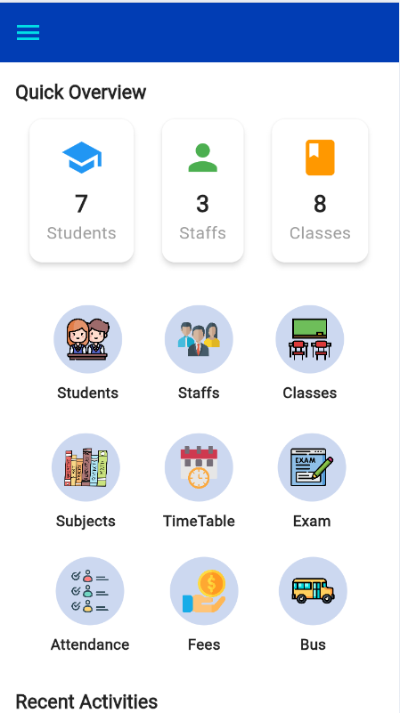

# School App

This project is developed using Flutter for both Admin and Parent applications, with a backend powered by GraphQL, Apollo Server, and MongoDB. Firebase is used for authentication. Used GetX for state management and MongoDB for Database.

Admin App: - Allowed the addition, updating, and deletion of students, teachers, classes, subjects and timetables. - Integrated backend with GraphQL for efficient CRUD operations and data retrieval.

Parent App: - Enabled parents to view their child's profile and switch between multiple children. - Provided access to timetable for each child.

This project was developed as part of my Flutter, GraphQL, and Firebase learning.
